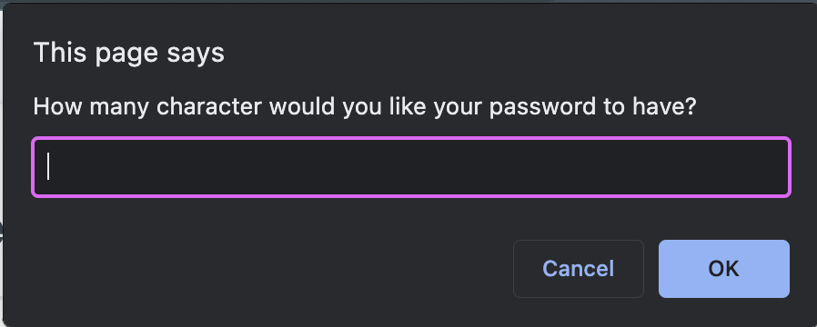
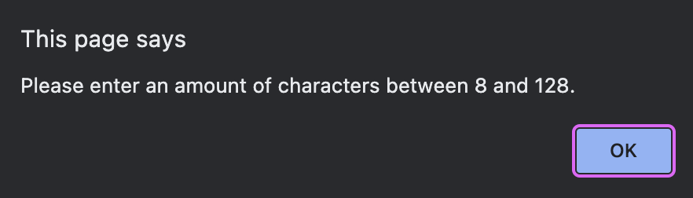
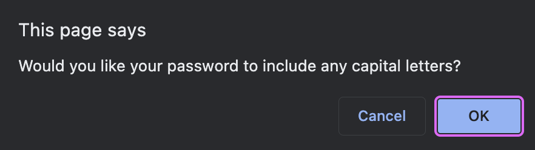
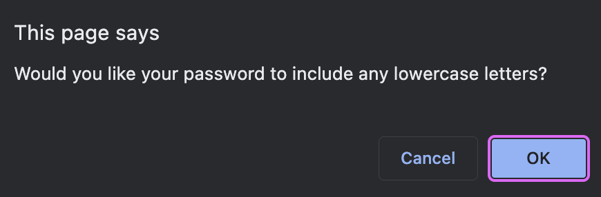
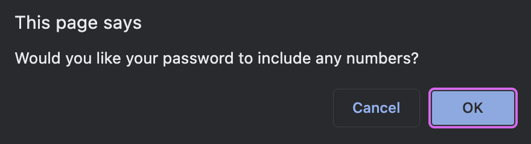
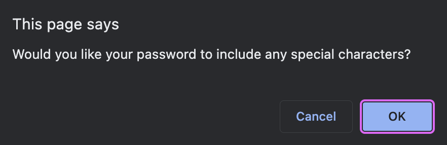
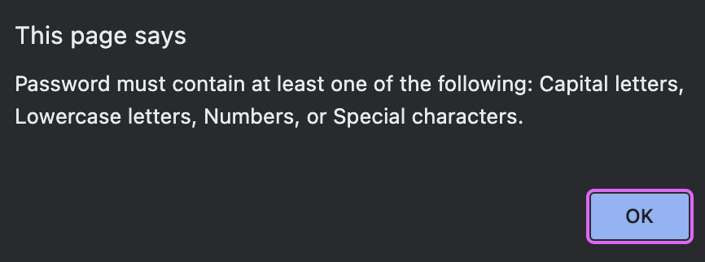

# javascript-password-generator

## Description of what is working so far

The purpose of this page is to ask the user for criteria that will help to generate a password using Javascript. 

Given that the javascript was already somewhat layed out, I tried to use that to guide me to create the functionality of this web page. 

I started by making varibales inside of the write password function for the number of characters, capital letters, lowercase letters, numbers, and special characters. 

In this same section, I also added some if statements. One was for if the number of characters given by the user was less than 8 or greater than 128. If this was the case, an alert would tell the user that they must enter a number within that range. The second if statement I added was in case the user said no to capital letters, lowercase letters, numbers, and special characters. In this case, the user is told that they must choose at least one of those to include, then they are given all of the confirm options again. 

## Description of what I still need to work on

Given that the output of each of these variables inside of the function is necessary to help actually start generating the password, I'm gonna have to be able to access them. I understant that they were declared within the local scope and I am goin to need to access them in the global scope, but I am struggling with how to pull them out. I tried using a return but couldn't quite figure that out.

I am going to submit the assignment as it is right now, but continue to work on it throughout the weekend. I think I know how to finish it once I retrieve the values I need, but I have been very stuck on this and need guidance. I have a tutoring appointment this week and plan on asking questions during that time.

## Working Web page Images

## Github link
[Github Link](https://kamarygillespie4.github.io/javascript-password-generator/)
